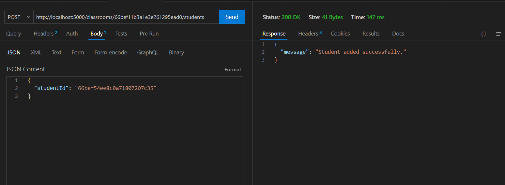
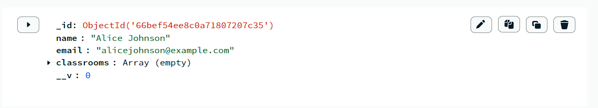
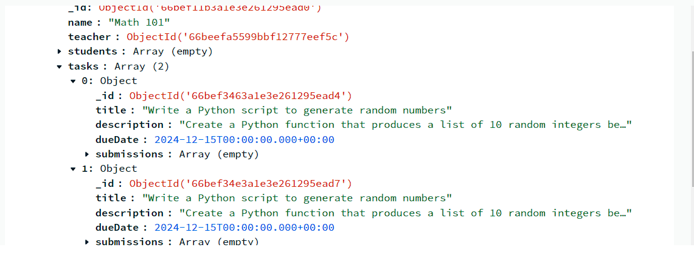
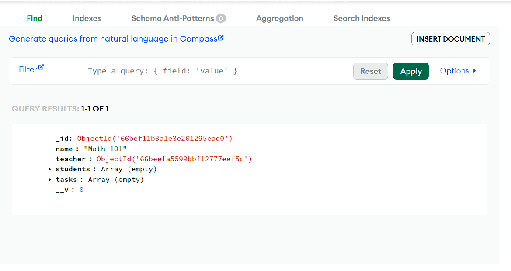

# ClassConnect Backend API

*ClassConnect* is a platform that facilitates classroom management. It supports two user roles: Teachers and Students. Teachers can create and manage classrooms, assign tasks, and handle student enrollment, while students can view their classrooms and tasks.

## Table of Contents

- [Getting Started](#getting-started)
- [API Endpoints](#api-endpoints)
  - [Teacher Functionality](#teacher-functionality)
    - [Create Classroom](#create-classroom)
    - [Add/Remove Students in Classroom](#addremove-students-in-classroom)
    - [Assign Tasks](#assign-tasks)
    - [Manage Classrooms](#manage-classrooms)
    - [Task Submission Status](#task-submission-status)
  - [Student Functionality](#student-functionality)
    - [View Classrooms](#view-classrooms)
    - [View Tasks](#view-tasks)
- [Data Models](#data-models)
- [Database Schema](#database-schema)
- [Setup Instructions](#setup-instructions)

## Getting Started

To set up the ClassConnect API on your local machine:

1. Clone the repository.
2. Install dependencies:
   bash
   npm install
   
3. Set up your environment variables:
   - Create a .env file and add your database connection string, other configurations.
4. Run database migrations:
   bash
   npm run migrate
   
5. Start the development server:
   bash
   nodemon server1.js

   ## API Endpoints

### Teacher Functionality

#### 1. Create Classroom
- *Endpoint*: POST /teachers/{teacherId}/classrooms
- *Description*: Teachers can create multiple classrooms, each with a unique name.
- *Request Body*:
  json
  {
    "classroomName": "string"
  }
  
- *Response*:
  json
  {
    "classroomId": "string",
    "classroomName": "string"
  }

  #### 2. Add/Remove Students in Classroom

- *Add Student*
  - *Endpoint*: POST /classrooms/{classroomId}/students
  - *Description*: Teachers can add students to their classrooms.
  - *Request Body*:
    json
    {
      "studentId": "string"
    }
    
  - *Response*:
    json
    {
      "message": "Student added successfully."
    }

    *Remove Student*
  - *Endpoint*: DELETE /classrooms/{classroomId}/students/{studentId}
  - *Description*: Teachers can remove students from their classrooms.
  - *Response*:
    json
    {
      "message": "Student removed successfully."
    }

    #### 3. Assign Tasks
- *Endpoint*: POST /classrooms/{classroomId}/tasks
- *Description*: Teachers can assign tasks to each classroom.
- *Request Body*:
  json
  {
    "title": "string",
    "description": "string",
    "dueDate": "YYYY-MM-DD"
  }
  
- *Response*:
  json
  {
    "taskId": "string",
    "title": "string",
    "description": "string",
    "dueDate": "YYYY-MM-DD"
  }

  
#### 4. Manage Classrooms

- *View Classrooms*
  - *Endpoint*: GET /teachers/{teacherId}/classrooms
  - *Description*: Teachers can view a list of their classrooms.
  - *Response*:
    json
    [
      {
        "classroomId": "string",
        "classroomName": "string"
      }
    ]
    

- *Edit Classroom*
  - *Endpoint*: PUT /classrooms/{classroomId}
  - *Description*: Teachers can edit the name of a classroom.
  - *Request Body*:
    json
    {
      "classroomName": "string"
    }
    
  - *Response*:
    json
    {
      "message": "Classroom updated successfully."
    }
    

- *Delete Classroom*
  - *Endpoint*: DELETE /classrooms/{classroomId}
  - *Description*: Teachers can delete a classroom.
  - *Response*:
    json
    {
      "message": "Classroom deleted successfully."
    }

    
#### 5. Task Submission Status
- *Endpoint*: GET /classrooms/{classroomId}/tasks/{taskId}/submissions
- *Description*: Teachers can view which students have or have not submitted tasks.
- *Response*:
  json
  [
    {
      "studentId": "string",
      "studentName": "string",
      "status": "submitted/pending"
    }
  ]
  
  ### Student Functionality

#### 1. View Classrooms
- *Endpoint*: GET /students/{studentId}/classrooms
- *Description*: Students can view a list of the classrooms they are enrolled in.
- *Response*:
  json
  [
    {
      "classroomId": "string",
      "classroomName": "string"
    }
  ]
  

#### 2. View Tasks
- *Endpoint*: GET /students/{studentId}/classrooms/{classroomId}/tasks
- *Description*: Students can view tasks assigned to their classrooms.
- *Response*:
  json
  [
    {
      "taskId": "string",
      "title": "string",
      "description": "string",
      "dueDate": "YYYY-MM-DD"
    }
  ]
  
## Data Models

### User
- *id*: UUID (Primary Key)
- *username*: String
- *email*: String
- *password_hash*: String
- *role*: Enum (Teacher, Student)

### Classroom
- *id*: UUID (Primary Key)
- *name*: String
- *teacherId*: UUID (Foreign Key to User)

### StudentClassroom
- *id*: UUID (Primary Key)
- *studentId*: UUID (Foreign Key to User)
- *classroomId*: UUID (Foreign Key to Classroom)

### Task
- *id*: UUID (Primary Key)
- *title*: String
- *description*: String
- *dueDate*: Date
- *classroomId*: UUID (Foreign Key to Classroom)

### Submission
- *id*: UUID (Primary Key)
- *taskId*: UUID (Foreign Key to Task)
- *studentId*: UUID (Foreign Key to User)
- *status*: Enum (submitted, pending)

4. *API Testing*:
   - Use Postman or any API testing tool to test the API endpoints as per the documentation provided above.
